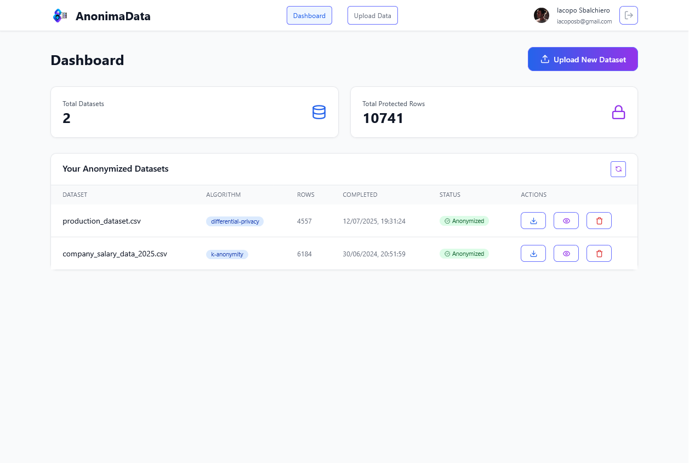

# AnonimaData


Exam project by [Pietro Coloretti](https://github.com/PietroColoretti01), [Leonardo Gennaioli](https://github.com/leonardo-gennaioli) and [Iacopo Sbalchiero](https://github.com/IacopoSb) for the course Scalable and Reliable Services in the Computer Engineering Second Cycle Degree @ Unibo, Academic Year 2024-2025.

## Abstract

AnonimaData is a comprehensive data management and analysis toolkit designed to streamline workflows for data scientists, analysts, and developers. The repository provides modular utilities for data ingestion, cleaning, transformation, visualization, and export. With a focus on scalability and ease of use, AnonimaData supports multiple data formats and integrates seamlessly with popular data science libraries. The project aims to foster reproducible research and efficient data-driven decision-making.

## Repository Structure

```
AnonimaData/
├── backend/                # Python microservices for data anonymization workflows
│   ├── anonymizer/         # Implements anonymization algorithms (k-Anonymity, l-Diversity, etc.)
│   ├── formatter/          # Handles data formatting and preprocessing
│   ├── orchestratore/      # Orchestrates workflow and service coordination
├── docs/                   # Project report and ppt (italian language)
├── frontend/               # React-based web application for user interaction
├── stressTests/            # Scripts for stress testing and performance evaluation
├── main.tf                 # Terraform configuration for infrastructure setup
├── README.md               # Project overview and instructions
└── variables.tf            # Terraform variables for deployment customization
```

## General Information

### Architecture

* **Backend**: Python microservices for orchestrating anonymization workflows, formatting data, and applying privacy algorithms. Each service is containerized and deployed on Google Cloud Run.
* **Frontend**: React application built with Vite, styled using Tailwind CSS, providing an intuitive interface for dataset upload, configuration, and result visualization.
* **Infrastructure**: Managed via Terraform, with resources for Cloud Run services, Pub/Sub topics/subscriptions, VPC connectors, and service accounts.
* **Messaging**: Google Pub/Sub is used for decoupled communication between services (Formatter, Orchestrator, Anonymizer).

### Key Features

* **Dataset Upload**: Supports CSV, Excel, JSON, and TXT formats.
* **Column Configuration**: Automatic detection of column types, user selection of Quasi-Identifiers (QI), and columns to anonymize.
* **Anonymization Methods**: k-Anonymity, l-Diversity, Differential Privacy, with configurable parameters.
* **Job Management**: Track status and download anonymized datasets and samples.
* **Extensibility**: Easily add new anonymization algorithms or data processing modules.


*The homepage of the web application*

### Deployment

* **Docker**: Each service and the frontend can be built and pushed as Docker images.
* **Terraform**: Infrastructure as code for reproducible cloud deployments.
* **Cloud Run**: Scalable, serverless execution of backend and frontend services.

### Testing

Stress tests and performance scripts are available in `📂 stressTests`.

## Authors

| Name                                                                                                                                                     | GitHub Profile                               |
| -------------------------------------------------------------------------------------------------------------------------------------------------------- | -------------------------------------------- |
| <div align="center"><br>Pietro Coloretti</div>    | [GitHub](https://github.com/PietroColoretti01)  |
| <div align="center"><br>Leonardo Gennaioli</div> | [GitHub](https://github.com/leonardo-gennaioli) |
| <div align="center"><br>Iacopo Sbalchiero</div>            | [GitHub](https://github.com/IacopoSb)           |
